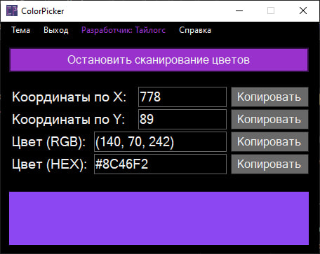

# Color selection

ColorPicker - a program that allows you to get the color of a pixel located under the display.

Already knows how to:

- [x] Obtaining RGB and HEX colors of a pixel;
- [x] Copy values ​​using buttons;
- [x] Dark/Light theme and beautiful interface;
- [x] Ability to preview colors in the panel below;
- [x] Obtaining the coordinates;
- [x] Ability to compress spaces to freeze and unfreeze pixel color information;
- [x] Built-in mini-help;
- [x] Ability to select color by clicking on the bottom panel (color block)

In the future it will be implemented:

- [ ] Leaving after closing in tray.

Necessary:

- Availability of Net (But many people already have it unknowingly installed)